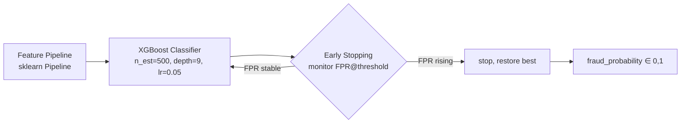
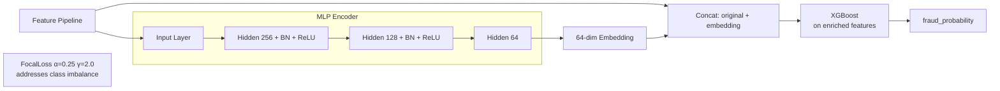
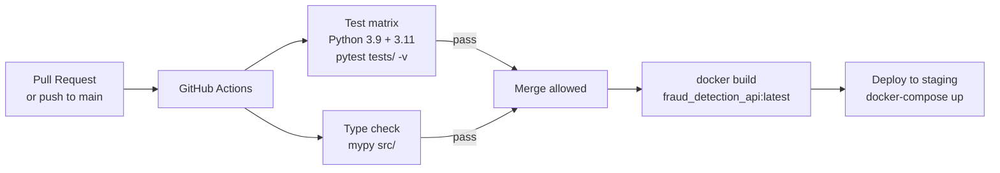

# System Architecture

This document describes the end-to-end architecture of the fraud detection platform using diagrams that can be rendered in any Mermaid-compatible viewer (GitHub, VS Code, Notion, etc.).

---

## 1. End-to-End Data & Training Pipeline

```mermaid
flowchart TD
    subgraph Ingestion
        A[train_transaction.csv] --> C[data_loader.load_data]
        B[train_identity.csv]    --> C
        C --> D[reduce_mem_usage\nfloat64→float32, int64→int32]
        D --> E[clean_data\ndrop cols >70% missing]
    end

    subgraph Feature Engineering
        E --> F[build_features\nMagic UID = card1 + addr1 + floor day-D1]
        F --> G[normalize_d_columns\nD2..D15 relative to D1]
        G --> H[uid aggregations\nmean/std/min/max of C-cols, M-cols, D-norm-cols]
        H --> I[get_full_pipeline\nFrequencyEncoder + SimpleImputer + StandardScaler]
    end

    subgraph OOT Split
        I --> J{time_consistency_split}
        J -->|months 0-5| K[X_train / y_train]
        J -->|month 6|   L[X_test  / y_test]
    end

    subgraph Model Training
        K --> M1[XGBoost\nFPR early stopping]
        K --> M2[MLP Encoder\nFocalLoss → embeddings]
        M2 --> M2b[XGBoost on\nenriched features]
    end

    subgraph Evaluation
        M1  --> E1[FPR sweep\n0.1%→25% FPR]
        M2b --> E1
        L   --> E1
        E1  --> E2[partial AUC @5% FPR\ndollar recall\nMLflow logging]
    end

    subgraph Artefacts
        M1  --> AR[models/xgboost_fraud_model.joblib]
        I   --> AR2[models/feature_pipeline.joblib]
    end
```

---

## 2. Model Architecture Detail

### 2a. Baseline — XGBoost with FPR Early Stopping



### 2b. MLP → XGBoost Hybrid



---

## 3. API Serving Architecture

```mermaid
flowchart LR
    subgraph Client
        C1[Mobile / Web App]
        C2[Payment Gateway]
        C3[Batch Job]
    end

    subgraph Fraud API  port 8000
        GW[FastAPI\nuvicorn workers=4]
        GW --> R1[POST /predict\nsingle transaction]
        GW --> R2[POST /predict_batch\nlist of transactions]
        GW --> R3[GET /health]
        R1 --> DI[Dependency Injection\nload pipeline + model once at startup]
        R2 --> DI
        DI --> FP3[feature_pipeline.joblib]
        DI --> XGB5[xgboost_fraud_model.joblib]
        XGB5 --> THR{fraud_prob ≥ 0.85?}
        THR -->|yes| FRAUD[is_fraud: true]
        THR -->|no|  OK[is_fraud: false]
    end

    subgraph Observability
        GW --> MLF[MLflow UI\nport 5000]
    end

    C1 --> GW
    C2 --> GW
    C3 --> GW
```

---

## 4. Hyperparameter Tuning Flow

```mermaid
sequenceDiagram
    participant Dev as Developer
    participant Opt as Optuna
    participant Train as train.py
    participant YAML as model_config.yaml
    participant MLF as MLflow

    Dev->>Opt: make tune MODEL=mlp_xgboost TRIALS=100
    loop 100 trials
        Opt->>Train: suggest params (hidden_dims, lr, depth, ...)
        Train->>Train: OOT split + feature engineering
        Train->>Train: train encoder → extract embeddings → train XGBoost
        Train->>MLF: log trial params + FPR metric
        Train-->>Opt: return FPR@threshold (objective to minimise)
    end
    Opt->>YAML: write best params to configs/model_config.yaml
    Dev->>Train: make train MODEL=mlp_xgboost
    Train->>YAML: read best params
    Train->>MLF: log final run
```

---

## 5. CI/CD Pipeline


